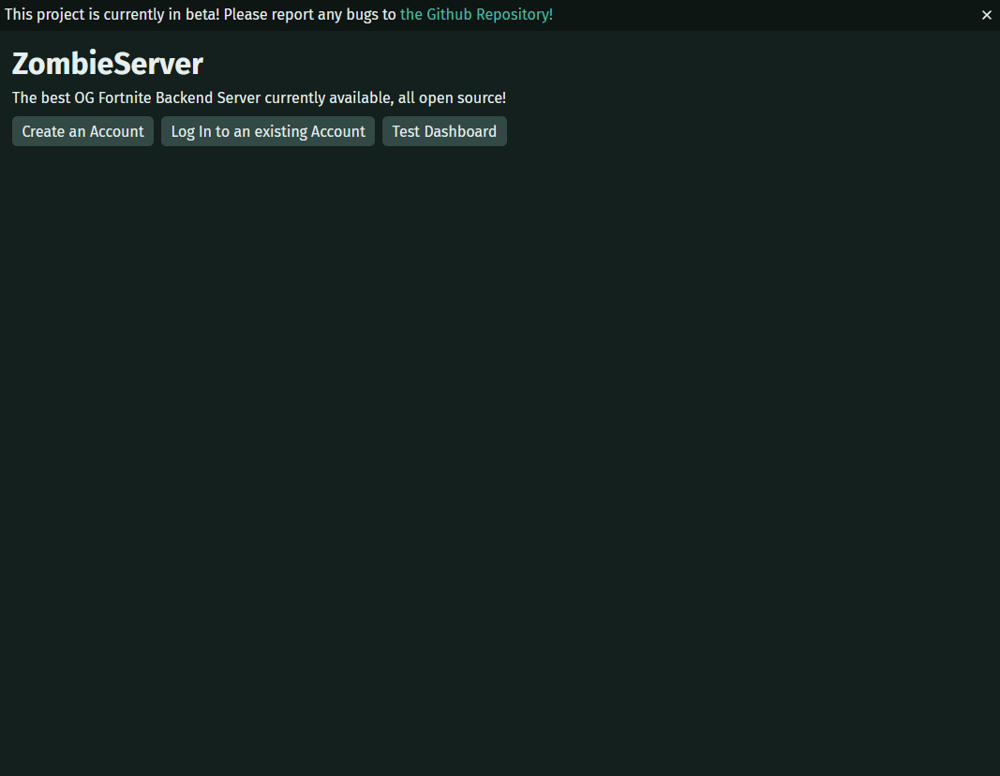
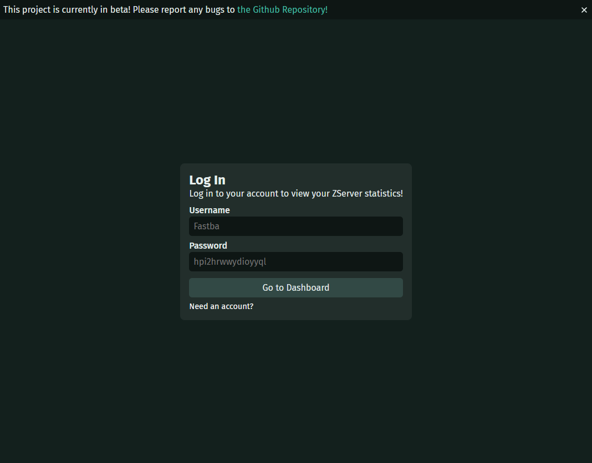
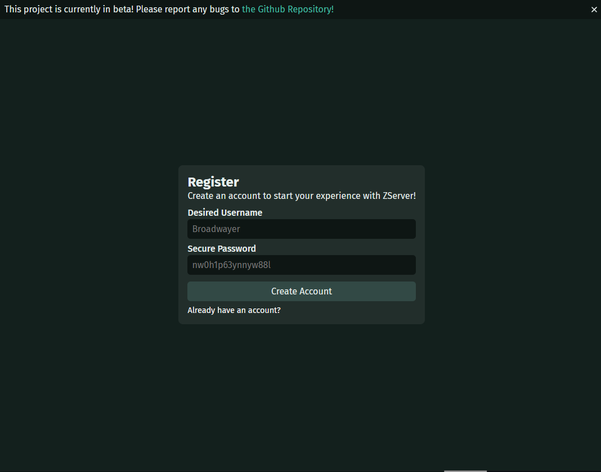
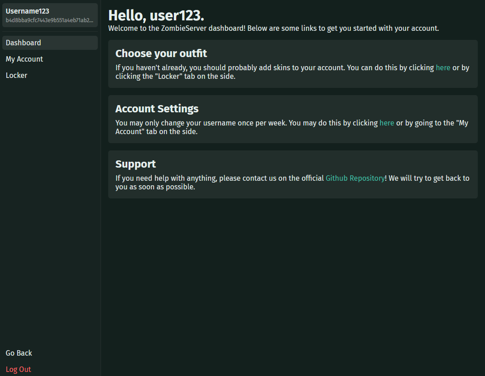
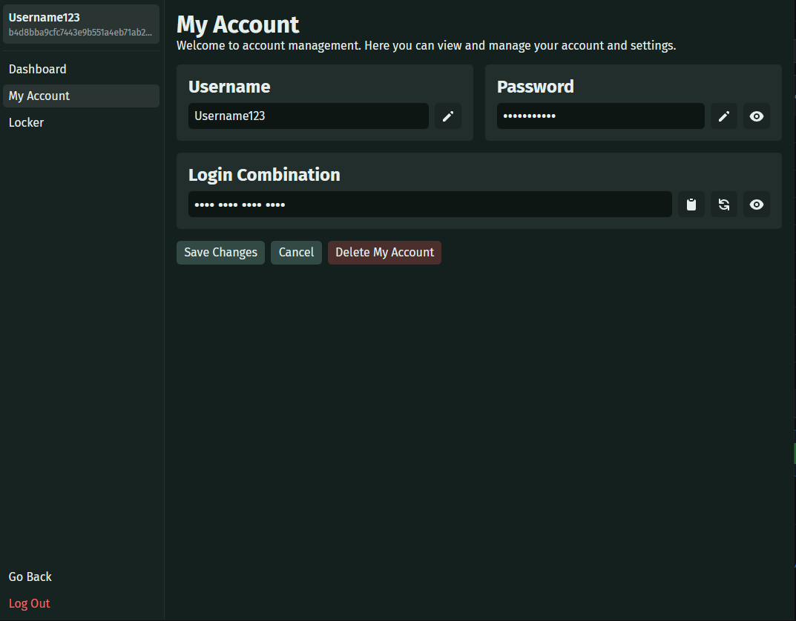

# Zombie Server

An open source, performant fortnite backend server with a built in web-interface and desktop launcher!

_Note: Some features are not yet implemented, please see the [Roadmap](#roadmap) for more information._

## Installation

- Uses a PostgresQL database to ensure that data is stored securely and quickly.
- Web interface is built with React so users can easily manage their account without having to use the desktop app.
- Admins can manage users and servers from the web interface.
- Desktop app is built with Tauri which allows for a native experience on all platforms.
- Backend (will be) written in Go to ensure that the server is performant and secure.

## Usage

### Screenshots of web interface

## Roadmap

## Development

- **[Tauri](https://tauri.app/)** - The framework used to build the app.
- **[React](https://react.dev/)** - Frontend framework used to build the UI.
- **[Zustand](https://github.com/pmndrs/zustand)** - State management library used to manage the app state.

### Prerequisites

- **[WebView2 Runtime](https://developer.microsoft.com/en-us/microsoft-edge/webview2/)** - Required for the desktop app to run on Windows. (Alrady installed on Windows 11)
